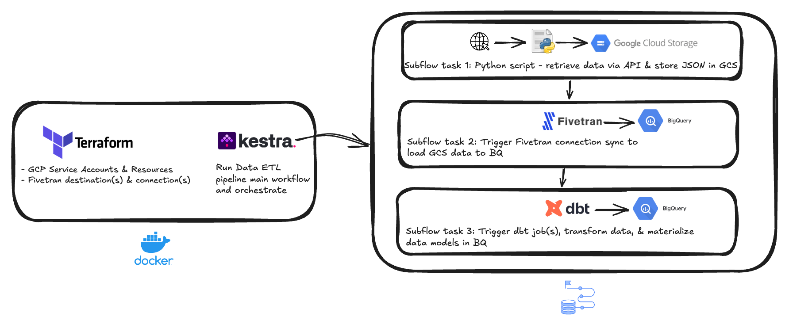

## Data Platform Project

This project aims to simulate a lightweight/scrappy data analytics infrastructure using free-tier enterprise data apps:
* dbt cloud [data transformation & orchestration]
* Terraform [IaC]
* Google Cloud Platform [Service Accounts/IAM, DWH, object storage]
* Docker [containers for apps & environments]
* Kestra [orchestration]
* Github [repo & PR CI]



### Highlights/Lowlights
Terraform <> Fivetran - The building of resources was straightforward. However there are a few gaps that I encountered:
* Initial configuration of destination and connection requires a user to interact with Fivetran's web based UI i.e. testing the connection
* Some connection attributes codified in Terraform do not seem to propagate through to Fivetran. e.g. base path for targeting specific datasets in GCS bucket
* Some tablestakes connection attributes _cannot_ be codified e.g. sync schedule

## Project Artifacts

### Requirements
* Docker MacOS App
* dbt cloud / CLI
* Terraform Docker image
* Kestra Docker image
* gcloud CLI
* GCP account
* Fivetran account
* Github account
* Homebrew [optional]

### Environment Variables

| Name                           | Description                                                 |
|--------------------------------|-------------------------------------------------------------|
| terraform-service-account      | `Private key` - Used for spinning up GCP/Fivetran resources |
| dbt-service-account            | `Private key` - Used for connecting dbt env to BQ (DWH)     |
| fivetran_api_key               | Used to deploy Fivetran resources and trigger syncs         |
| fivetran_api_secret            | Used to deploy Fivetran resources and trigger syncs         | 
| fivetran_connector_id (s)      | Used to trigger syncs                                       | 
| SECRET_PATH                    | Local path to secret keys                                   | 
| GOOGLE_APPLICATION_CREDENTIALS | Set in local .zshrc file for auth'ing Terraform against GCP | 

### Project Structure

```
repo
├── data-ingestion/
│   ├── Dockerfile
│   ├── requirements.txt
│   ├── main.py
│   └── src/
│       ├── common/
│       │   ├── config.py
│       │   ├── data_io_classes.py
│       │   └── ingest_pipeline.py
│       └── endpoint_extractor/
│           ├── comments_extractor.py
│           ├── posts_extractor.py
│           └── users_extractor.py
│       └── tests/
├── dbt/
│   ├── dbt_project.yml
│   ├── models/
│   │   ├── base/
│   │   ├── staging/
│   │   ├── intermediate/
│   │   └── exposure/
│   ├── macros/
│   ├── seeds/
│   ├── snapshots/
│   └── tests/
├── infrastructure/
│   ├── main.tf
│   ├── terraform.tfvars
│   ├── variables.tf
│   ├── modules/
│   │   ├── fivetran/
│   │   └── gcp/
├── orchestration/
│   ├── workflows/
│   │   ├── data_extract.yml
│   │   ├── data_pipeline.yml
│   │   ├── fivetran_load.yml
│   │   └── run_data_ingestion.yml
│   └── data/
├── utils/
│   └── tfstate_cleanup.sh
├── docker-compose.yml
└── README.md
```